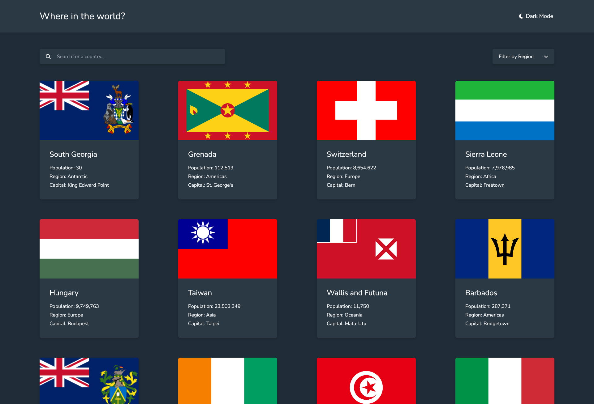
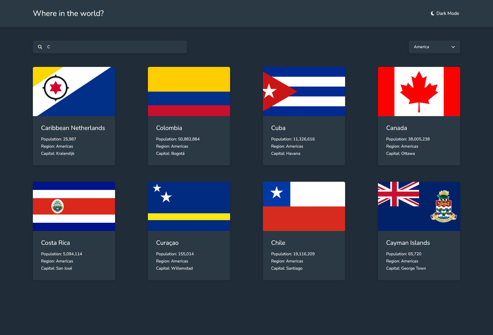
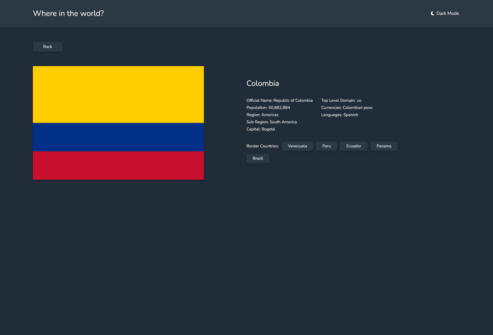
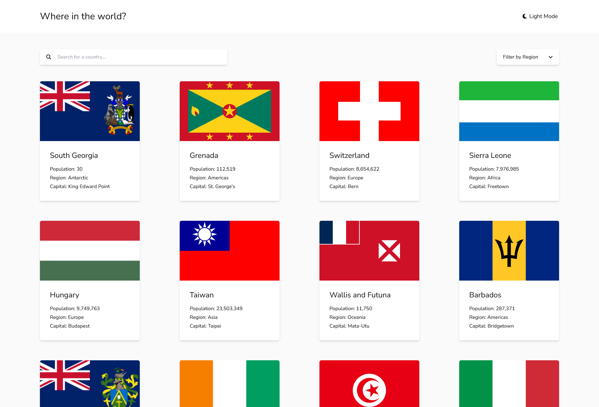
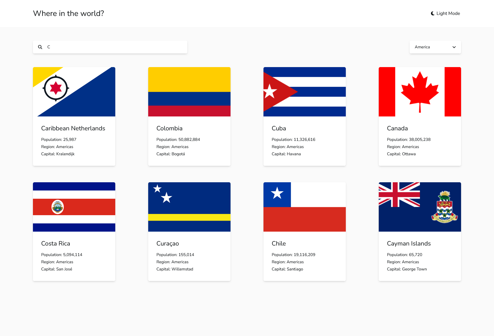
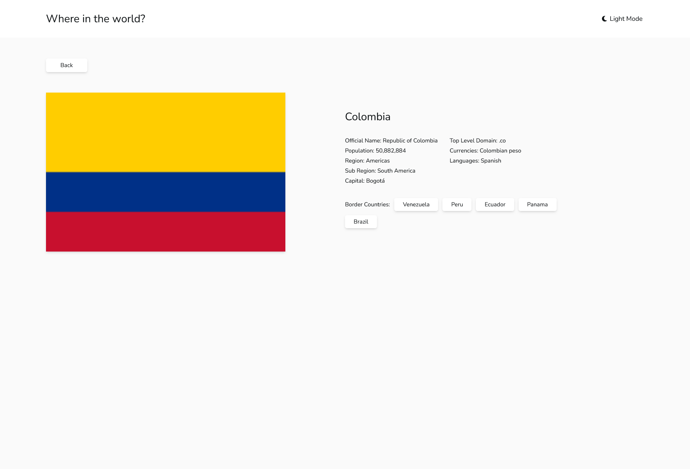

# Frontend Mentor - REST Countries API with color theme switcher solution

This is a solution to the [REST Countries API with color theme switcher challenge on Frontend Mentor](https://www.frontendmentor.io/challenges/rest-countries-api-with-color-theme-switcher-5cacc469fec04111f7b848ca). Frontend Mentor challenges help you improve your coding skills by building realistic projects. 

## Table of contents

- [Overview](#overview)
  - [The challenge](#the-challenge)
  - [Screenshots](#screenshot)
- [My process](#my-process)
  - [Built with](#built-with)
  - [What I learned](#what-i-learned)
- [Author](#author)

## Overview

### The challenge

Users should be able to:

- See all countries from the API on the homepage
- Search for a country using an `input` field
- Filter countries by region
- Click on a country to see more detailed information on a separate page
- Click through to the border countries on the detail page
- Toggle the color scheme between light and dark mode *(optional)*

### Screenshots













## My process

### Built with

- Semantic HTML5 markup
- CSS custom properties
- Flexbox
- Mobile-first workflow
- [React](https://reactjs.org/) - JS library
- [Tailwind CSS](https://tailwindcss.com/) - For styles

### What I learned

I am especially proud of my solution for building cohesive search bar and filter drop-down elements. Applying the useContext and useReducer hooks from React, I was able to display countries on the main page by region and/or keystrokes in the search bar. Since both functionalities tap into a shared state, the user is able search and filter countries by region simultaneously. Additionally, this shared state persists after the user navigates to a country's details page, so the user will return to the previous search/filter results when the back button is clicked.

By choosing to manage state with context, I streamlined state-sharing among sibling components, prevented any consideration of prop-drilling in the solution, and improved the user's experience by keeping track of their inputs.

```js
function filterReducer(state, action) {
  if (action.type === "INITIALIZE") {
    return {...state, data: action.response, visibleData: action.response}
  }

  if (action.type === "REGION") {
    var filteredData = [];
    if (state.activeSearch == "" || state.activeSearch == undefined) {
      filteredData = state.data.filter((country) => country.region == action.region);
    } else {
      filteredData = state.data.filter((country) => country.region == action.region);
      filteredData = filteredData.filter((country) => country.name.common.startsWith(state.activeSearch));
    }

    return {...state, visibleData: filteredData, activeRegion: action.region}
  }

  if (action.type === "SEARCH") {
    var filteredData = [];
    if (state.activeRegion == undefined) {
      filteredData = state.data.filter((country) => country.name.common.startsWith(action.userInput));
    } else {
      filteredData = state.data.filter((country) => country.region == state.activeRegion);
      filteredData = filteredData.filter((country) => country.name.common.startsWith(action.userInput));
    }

    return {...state, visibleData: filteredData, activeSearch: action.userInput}
  }

  return state;
};
```

I also practiced using the popular CSS framework, Tailwind CSS, to bolster maintainability and speed of implementing future updates. I learned how to extend themes in the tailwind.config.js file, defining fonts and colors for consistent use across the project. Gained experience using responsive utility variants, and looking forward to learning more about directives and reusing styles for future projects.

```html

<div id="country-card-overview" className="my-auto px-8">
  <h2 id="country-card-name" className="font-nunito text-2xl mb-4">
    {country.name.common}
  </h2>
  <h3 id="country-card-population" className="font-nunito text-base my-1">
    Population: {formattedPopulation}
  </h3>
  <h3 id="country-card-region" className="font-nunito text-base my-1">
    Region: {country.region}
  </h3>
  <h3 id="country-card-capital" className="font-nunito text-base my-1">
    Capital: {country.capital}
  </h3>
</div>
```

## Author

- Frontend Mentor - [@mjclaypool](https://www.frontendmentor.io/profile/mjclaypool)
